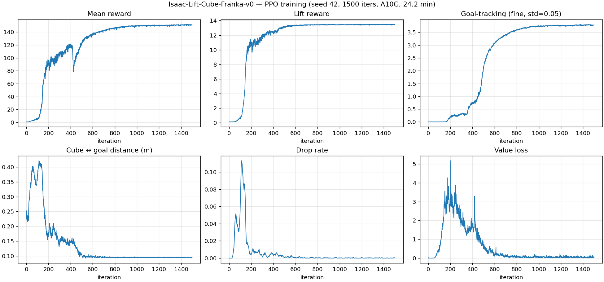

# Isaac Lab Manipulation — Reproduction Portfolio

Reproductions of canonical robotic manipulation RL baselines in
[NVIDIA Isaac Lab](https://isaac-sim.github.io/IsaacLab/) using the
[`rsl_rl`](https://github.com/leggedrobotics/rsl_rl) PPO implementation.

The goal is **reproduction**, not novelty: the trained policies should match
the reference behaviour and success rates reported in Isaac Lab's official
benchmarks, with no modifications to the official task configurations.

## Why this exists

This is a structured reproduction project, not a tutorial run-through. Each task
is reproduced under strict discipline ([CLAUDE.md §3](CLAUDE.md)): no reward
shaping, no custom hyperparameters, no shipping at "looks reasonable" reward
curves. A task counts as done only when the published benchmark's headline
number is matched on the evaluation distribution.

The intent is to demonstrate three things:

1. **Competence with the production-grade RL stack** that current sim-to-real
   groups use — Isaac Lab + `rsl_rl` is the default for ETH RSL, NVIDIA, and
   several Stanford / CMU manipulation labs.
2. **Precise reading of upstream code** — see
   [`docs/isaac-lift-cube-franka-v0.md`](docs/isaac-lift-cube-franka-v0.md) §"Eval
   methodology" for why the obvious "Play vs base config" distinction is mostly
   cosmetic on this task, and what the actual randomization surface is.
3. **Honest, seed-replicated reporting** — every headline is computed from N
   randomized rollouts on a fresh seed, not declared from a rising training-reward
   curve.

Companion repo `excavation-rl` (separate) takes the opposite stance: a self-built
RL substrate that did not converge to a working policy, kept as a documented
engineering / lessons-learned artefact. The two are intended to be read as a pair.

## Status

- [x] Day 1 — `Isaac-Lift-Cube-Franka-v0`: trained 1500 iters in **24.2 min** on A10G, eval **100 % success @ 2 cm goal** over 256 rollouts × 2 seeds, on the randomized training distribution. ([details](docs/isaac-lift-cube-franka-v0.md), [wandb](https://wandb.ai/yangchenghan2515-eth-z-rich/franka-manipulation-rl/runs/kd4z3ral), [mp4](results/videos/lift_cube_seed42.mp4))




## Tech stack

- Isaac Lab (Isaac Sim 4.x backend)
- `rsl_rl` PPO
- Wandb / TensorBoard logging
- A10G GPU on EC2 g5.xlarge for training

## Reproduction targets

| Task | Env ID | Reference success |
|---|---|---|
| Franka Lift Cube | `Isaac-Lift-Cube-Franka-v0` | > 90 % (Isaac Lab default) |

## Layout

```
isaac-lab-manipulation/
├── configs/        # any per-task config overrides (kept minimal)
├── scripts/        # launchers (train.sh, play.sh, record_video.sh)
├── docs/
│   └── session_handoffs/
└── results/
    ├── figures/    # training curves, eval plots
    └── videos/     # play-mode videos
```

Detailed install + repro commands per task will land in `docs/<task>.md` as
each is brought up.
